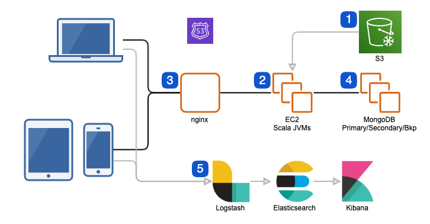
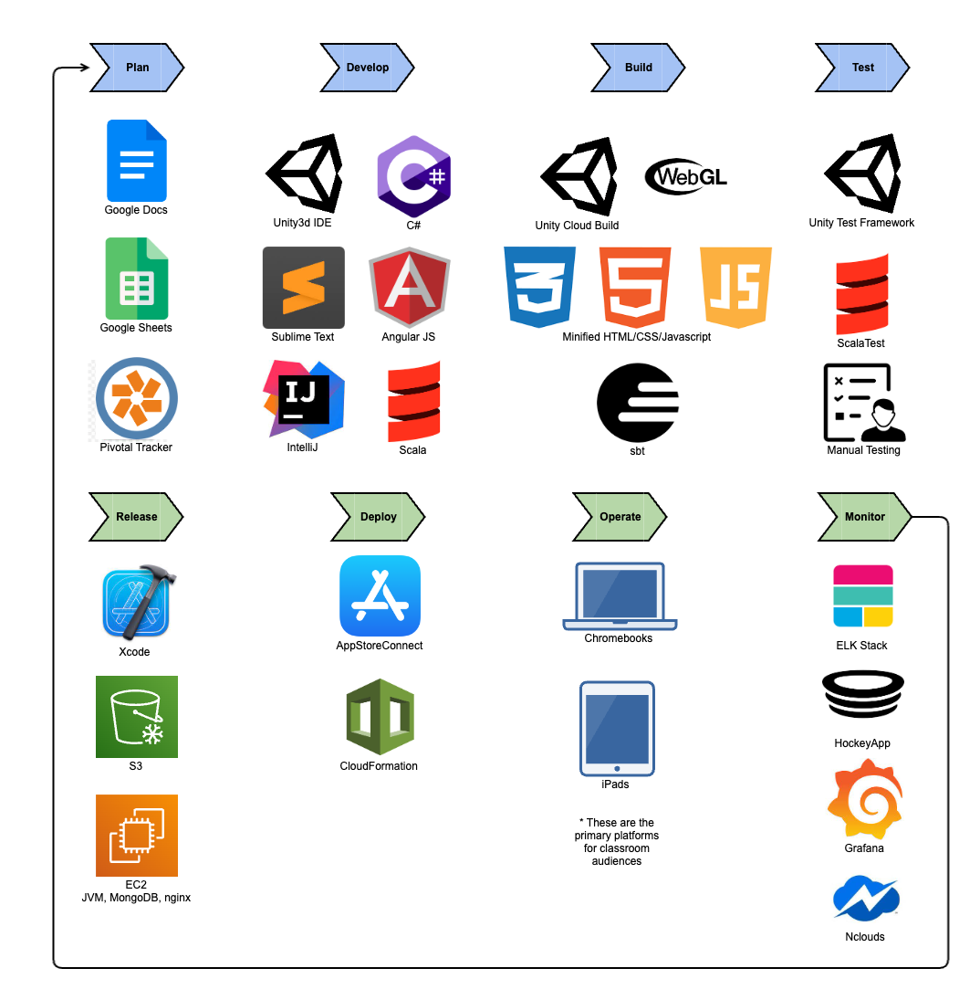

# Game Microservice Architecture and Pipeline
The following architecture and pipelines for cross-platform mobile games consisted of components designed to provide a seamless and secure gaming experience. They supported an audience of 200K students playing cross-platform mobile games that reported student concept mastery and behavioral data to their teachers and admins on a responsive site.

## Architecture

1.	Using CloudFormation for deployments provided a simple and efficient way to create and manage all of the necessary AWS resources, allowing for quick releases and scaling with demand, ensuring that the gaming experience remained smooth and uninterrupted for all users. Static AngularJS web files and WebGL game artifacts along with server code binaries were stored in S3. AngularJS and WebGL provided responsive and high-performing, interactive UIs for teacher dashboards and student games.
2.	EC2 instances ran JVMs for a Scala application. Scala is a powerful language with functional programming features that make it easy to write highly modular, reusable, and well-tested code for asynchronous data processing, leading to faster dev times and reduced maintenance/testing costs, an ideal choice for the backend of a gaming application with heavy data reporting needs.
3.	The use of Nginx as a reverse proxy helped to distribute the workload evenly across the EC2 instances, improving the overall performance and reliability of the system. REST APIs were secured by API keys and TLS encryption ensuring that all data transmitted was kept private and secure, protecting sensitive user data.
4.	MongoDB is a highly scalable, flexible NoSQL DB, making it an excellent choice for gaming applications that require fast and reliable data access. Its ability to handle large amounts of unstructured data allows for the storage and retrieval of complex data that changed regularly due to the evolutions of the games to improve learning and fun. Leveraged a JSON coast-to-coast backend design to maximize flexibility for game devs. 
5.	The ELK stack was cost-effective while providing visibility across the system.

## SDLC Pipeline

The entire SDLC pipeline along with the major tools and services we used are included below. Rather than exhaustively explain, here's some cool features:

1. Unity Cloud Build was managed by Unity itself which meant it remained compabitible as new versions were released. In addition to providing binary files that were smaller than those we generated on local computers, it also provided online previews that we leveraged for certain user tests on bleeding-edge features.
2. The ELK stack was cost-effective for the startup while providing visibility across the system.

